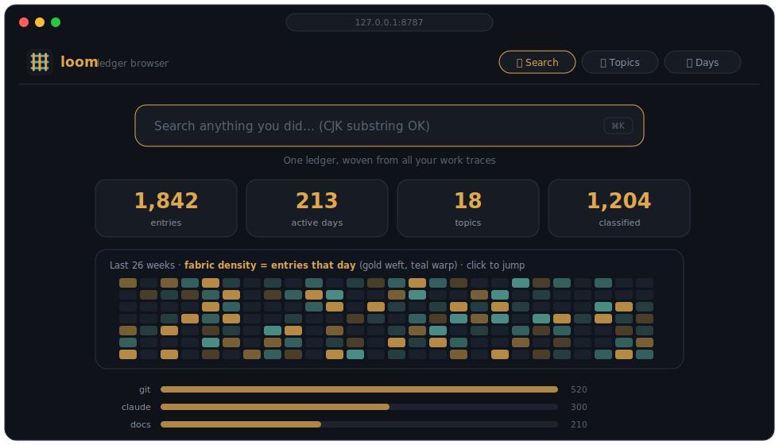
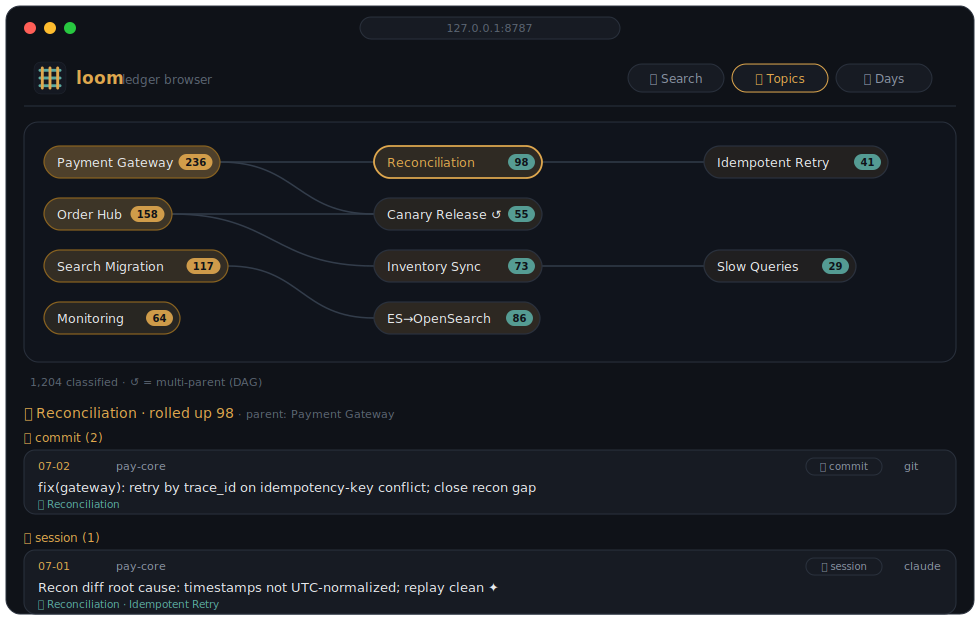
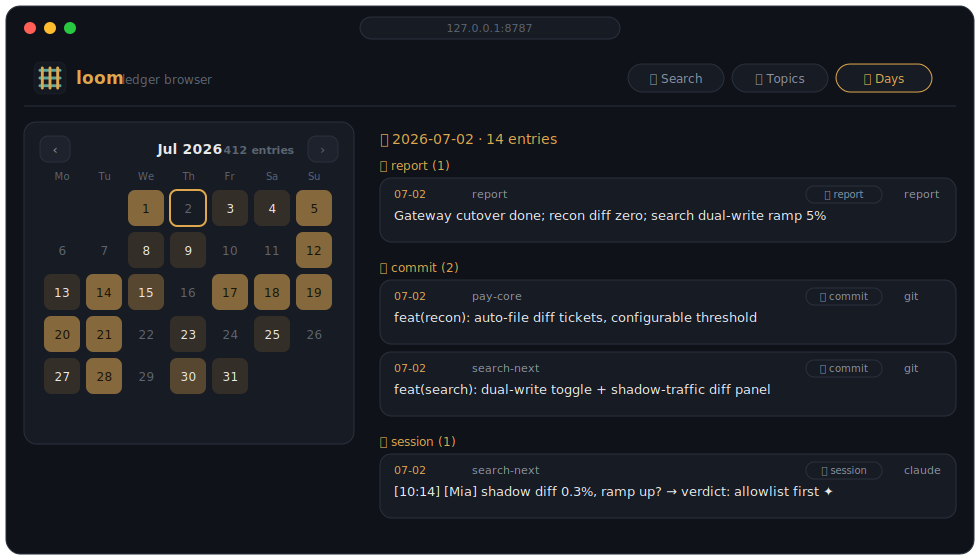

<div align="center">


# loom

**Weave your scattered work traces — git commits · AI chats · docs · code · data — into one searchable, connected ledger**

One flat source of truth → daily journals · full-text search · topic graph · private cloud backup. Every entry carries a **back-link** to its origin.

<br>


[](./LICENSE)


[简体中文](./README.md) | **English**

[📊 Tour](https://htmlpreview.github.io/?https://github.com/joycastle/loom/blob/main/docs/loom_tour.html)

<br>

</div>

---

> 🧵 **loom** collects *your own* work traces scattered across multiple git repos, AI coding sessions (Claude / Codex / Cursor / CodeBuddy), documents, code, data files and Feishu — normalizes them into one flat record stream, then weaves out search, daily journals, a topic DAG, and a private cloud backup. Pure-stdlib Python, **zero third-party dependencies**.

## ⚡ 5-minute setup: let your AI assistant drive (recommended)

loom ships **cross-tool AI entry files** — any assistant will find its way.

```bash
git clone https://github.com/joycastle/loom.git ~/Documents/loom
```

Open the folder with your favorite AI coding assistant and say:

> **"Read ONBOARDING.md and walk me through setup, then organize my history."**

It will pick up the rules files (`AGENTS.md` for Codex/Cursor/Copilot/Windsurf/CodeBuddy, `CLAUDE.md` for Claude Code) and follow [`ONBOARDING.md`](./ONBOARDING.md) — an AI-facing runbook: **setup → first collection → ingest loose files → private cloud backup → full topic classification → daily routine**.

Prefer manual? `cd ~/Documents/loom && ./install.sh`, then just `loom sync --push` daily.

## 🎨 Design highlights

Product tour: [loom_tour.html](https://htmlpreview.github.io/?https://github.com/joycastle/loom/blob/main/docs/loom_tour.html) · Deep technical walkthrough: [loom_showcase.html](https://htmlpreview.github.io/?https://github.com/joycastle/loom/blob/main/docs/loom_showcase.html).

- **① Flat storage, views on demand.** One truth file keyed by stable `id` (`entries.jsonl`); "by day", "by topic", "by project" are just different cuts. Capture once, visible on every axis.
- **② Summary + back-link only.** Each entry keeps the valuable short text (title, questions, commit rationale) plus a `ref` pointer; full transcripts / diffs / raw files stay where they live. Thousands of entries, still lightweight, always traceable.
- **③ Redaction before storage.** Tokens / secrets / webhooks are masked *before* anything is written (values only — variable names survive). Credentials live in `~/.loom/.env` (chmod 600), never in any repo.
- **④ Layered cloud sync.** Data files are distilled into searchable "data cards" (schema / stats / samples / lineage) that sync to your private repo; raw csv/xlsx stay local in gitignored `_data/`.
- **⑤ Topic layer is a DAG.** Entries carry only leaf tags; hierarchy lives on topic pages (`parent:` list = multi-parent). Queries roll up whole subtrees — one topic view stitches chats + commits + docs + data of "one thing" into a single decision trail.
- **⑥ Daily reports & session digests are AI-synthesized outputs**, not collection sources. `loom report gen` feeds a day's real traces to an AI; `loom session gen` reads a session's **questions and answers** to produce an accurate title + searchable digest (stored in a sidecar, survives re-collection).
- **⑦ Zero dependencies · 117 green tests.** Clone and run; redaction, path traversal, FTS recall, atomic writes and topic roll-up are all covered end-to-end.

## 📸 Screenshots (`loom serve`)

> Local zero-dependency browse UI, 127.0.0.1 only. Screenshots below use **fictional demo data**.

**Overview: spotlight search + fabric graph (your days, woven)**


**Topics: DAG graph — click a topic to see everything about "one thing"**


**By day: paginated calendar heatmap**


## Commands

```bash
loom init                      # interactive setup
loom sync [--push] [--since]   # collect all sources → render → commit (--push to cloud)
loom search <term> [--project P] [--tool T] [--since D] [--until D]
loom serve [--port 8787]       # local browse UI (127.0.0.1): search / topic tree / by-day
loom doc add | data add | note # ingest docs / data files (→ data cards) / loose notes
loom report import|gen|set     # daily reports (AI-synthesized)
loom session gen|set|ls        # AI session digests (reads Q&A, writes title+digest)
loom topic ls|gather|apply|show
loom deprecate <path> [--mark] # retire stale/wrong content (out of search, history kept)
loom repo add|rm|scan|ls · feishu add|rm|ls · identity add|ls · source enable|disable
```

## Config reference (`~/.loom/config.json`)

Generated by `loom init`; edit directly or via CLI subcommands. See [`config.example.json`](./config.example.json) for a full template.

| Field | What it controls | How to change |
|-------|-----------------|---------------|
| `repos` | **Which local git repos to scan.** Absolute paths (supports `~`). Only locally cloned repos — loom reads `git log`, not GitHub API. | `loom repo add ~/path/to/repo` or edit the array |
| `identities.emails` | Commit filter: only ingest commits whose author email matches this list | `loom identity add you@co.com` |
| `identities.names` | Author name fallback when email is missing | same |
| `sources.claude.projects_dir` | Claude Code transcript root, default `~/.claude/projects` | Rarely needs changing |
| `sources.codex.home` | Codex data dir, default `~/.codex` | Rarely needs changing |
| `sources.cursor.app_support` | Cursor data dir, default `~/Library/Application Support/Cursor` | Rarely needs changing |
| `sources.<name>.enabled` | `false` to disable a collector | `loom source disable cursor` |
| `feishu.bitables[]` | Bitable demand-pool list (app_token + table_id + field mapping) | `loom feishu add <URL>` |
| `vault.remote` | Git remote URL for private vault backup; empty = local only | Set during `loom init` |
| `default_since_days` | How far back the first `loom collect` reaches | Increase for history import |

> Credentials (Feishu app_secret etc.) go in `~/.loom/.env` (chmod 600), **never** in `config.json`. `loom init` guides you through this.

## Architecture

```
6 collection sources           normalize + redact         derived views
──────────────────            ──────────────────         ─────────────────────
git commits        ┐                                    ┌ FTS5 search (CJK substring)
Claude sessions    │                                    │ daily journals (markdown)
Cursor sessions    ├──►  loom  ──►  entries.jsonl  ──►  ├ topic DAG (roll-up queries)
Codex sessions     │   (one truth, redacted)            │ daily reports (AI-synthesized)
repo docs (.md)    │                                    ├ local browse UI (loom serve)
data·code·notes    ┘                                    └ private cloud backup (git)
```

Code lives in this repo; your instance lives in `~/.loom/` (config / .env / data / vault) — physically separate. `LOOM_HOME` overrides.

## Let AI in *any* project query your ledger

Add a one-paragraph global rule to your assistants (Claude Code `~/.claude/CLAUDE.md`, Codex `~/.codex/AGENTS.md`, Cursor user rules) so history questions hit `loom search` first. See [`docs/ai-global-access.md`](./docs/ai-global-access.md).

## Extending

Drop `xxx.py` into `loom/collectors/` implementing `collect(cfg, since) -> [entry]`, register it, done. Entry schema: `{id, date, ts, project, tool, kind, summary, ref, detail}`.

## License

[MIT](./LICENSE)

## 🤝 Contributing

Issues / PRs welcome: new collectors (just implement `collect(cfg, since)`), docs in other languages, pitfall notes.
Run `python3 -m pytest tests/test_loom.py` after changes (zero deps, should stay green).


---
**For AI assistants landing here**: read [`AGENTS.md`](./AGENTS.md) first; for first-time setup follow [`ONBOARDING.md`](./ONBOARDING.md).
