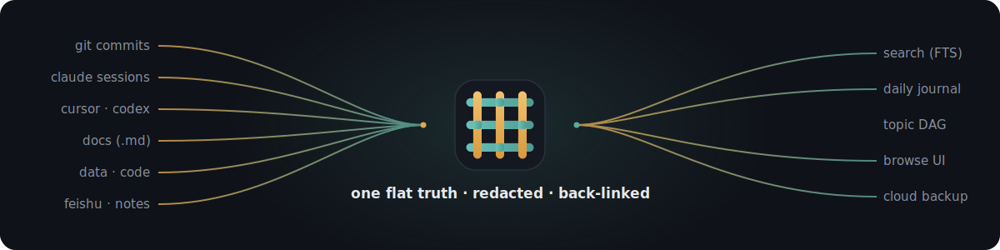
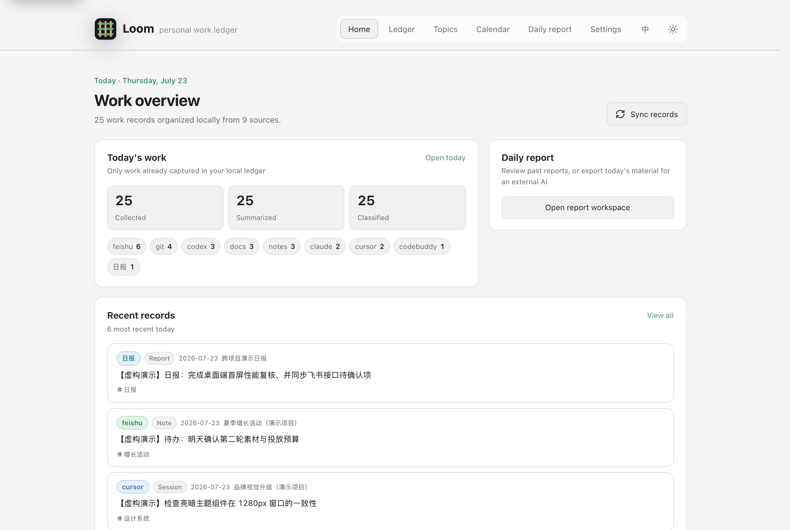
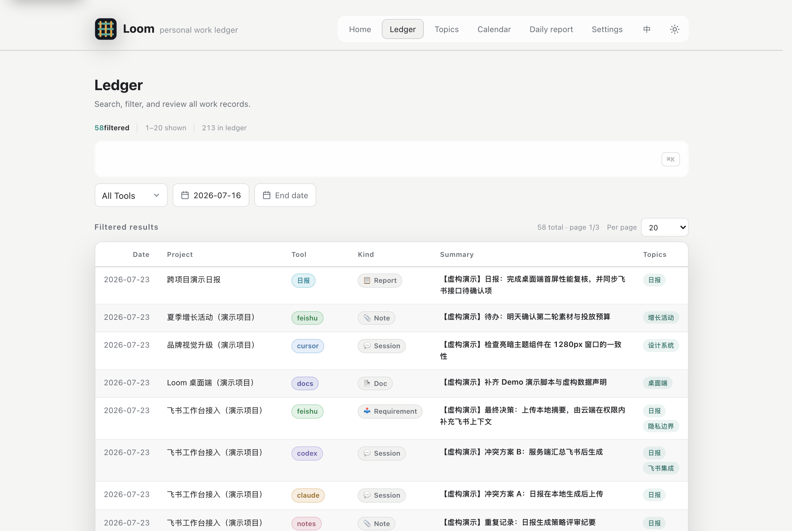
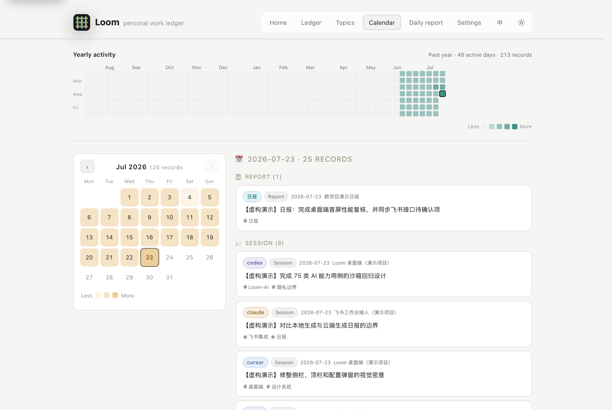
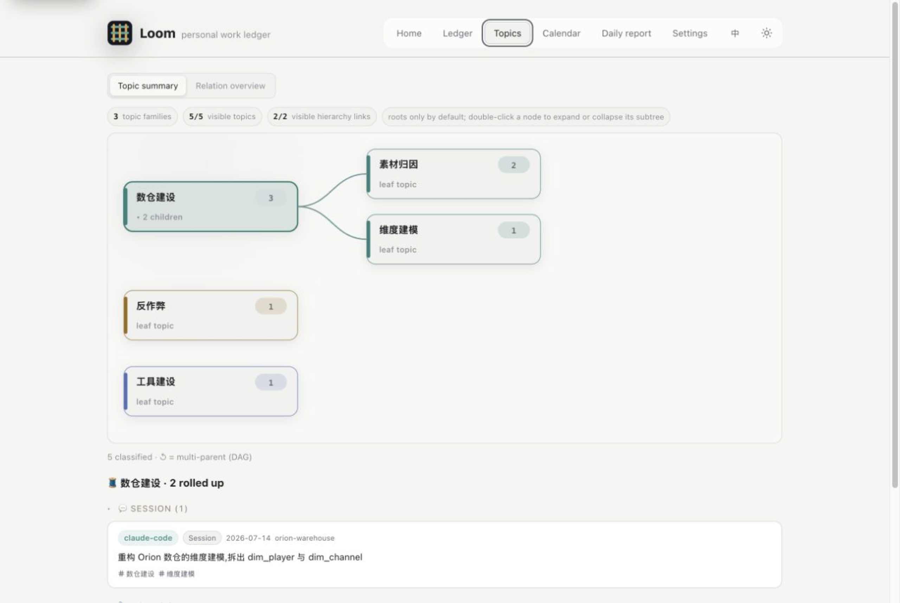

<div align="center">


# loom

**Weave your scattered work traces — git commits · AI chats · docs · code · data — into one searchable, connected local ledger**

One flat source of truth → daily journals · full-text search · topic graph · private cloud backup. Every entry carries a **back-link** to its origin.

<br>


[](./LICENSE)


[简体中文](./README.md) | **English**

[🚀 Quickstart](#-quickstart) · [📸 Screens](#-screenshots-loom-serve) · [🧵 Design](#-why-its-built-this-way) · [⌨️ Commands](#️-common-commands) · [🛡️ Data & security](#️-data--security)

<br>

</div>

---

**loom** collects *your own* work traces scattered across multiple git repos, AI coding sessions (Claude / Codex / Cursor / CodeBuddy / pi / OpenCode), docs, code and data — normalizes them into one flat record stream, then weaves out search, daily journals, a topic DAG, and a private cloud backup. **Pure-stdlib Python, zero third-party dependencies** — clone and run.

## 🚀 Quickstart

Installing loom lands two things: the **`loom` command** (the CLI that does the work) + the **loom skill** (dropped into your AI assistant so it knows how to drive `loom`). Pick one:

**1. Claude Code — install as a native plugin (fastest)** · type these slash commands inside a Claude Code session (not a shell):

```
/plugin marketplace add joycastle/loom
/plugin install loom@joycastle
```

**2. Codex / Cursor / any terminal — one line** · installs the `loom` command + drops the skill into every AI assistant present. Zero pip, zero packaging:

```bash
curl -fsSL https://raw.githubusercontent.com/joycastle/loom/main/install.sh | sh
```

**3. Manual**:

```bash
git clone https://github.com/joycastle/loom.git ~/Documents/loom && cd ~/Documents/loom && ./install.sh
```

Then: `loom sync` to collect, `loom serve` to open the admin page. Daily use is a single `loom sync` (add `--push` to back up to the cloud).

Codex Feishu Bridge topics are opt-in. Sign in with lark-cli, grant `search:message`, then run `loom source enable codex_feishu_bridge`. See [`docs/codex-feishu-bridge.md`](./docs/codex-feishu-bridge.md) for configuration and privacy boundaries.

**Let AI call loom directly (MCP)** · the skill teaches an AI *how to type* loom commands; MCP makes loom a **native tool** inside AI coding clients — `loom_search` your ledger and `loom_note` while coding, no commands to remember:

```bash
claude mcp add loom -- loom mcp-serve      # Claude Code; or put it in a project .mcp.json
```

Exposes five tools — `loom_search` / `loom_topic_ls` / `loom_topic_show` / `loom_today` / `loom_note` (read-mostly; writes are confirmed by your client). Pure stdio JSON-RPC, zero deps.

> **Want your AI to organize your history too?** After `git clone`, open the folder with your AI assistant and say: "**Read ONBOARDING.md, walk me through setup, then organize my history.**" It picks up the entry files (`AGENTS.md` / `CLAUDE.md`) and follows [`ONBOARDING.md`](./ONBOARDING.md): setup → first collection → ingest loose files → private cloud backup → topic classification → daily routine.

## 📸 Screenshots (`loom serve`)

> Local zero-dependency browse UI, 127.0.0.1 only, all admin — no chat. Real `loom serve` shots below, **fictional demo data**.



| Ledger (full-text search + filters + paging) | Calendar (heatmap + day view) | Topic hierarchy (double-click to expand) |
|:---:|:---:|:---:|
|  |  |  |

The Topics page keeps the two views distinct: **Topic summary** is a hierarchy tree that starts at the roots and expands on double-click; **Relation overview** is an aggregate matrix of real structural links across topic families.

## 🧵 Why it's built this way

loom's value isn't "another note tool" — it's a few deliberate design choices (full technical detail in [`docs/loom_showcase.html`](./docs/loom_showcase.html) · [product tour](https://htmlpreview.github.io/?https://github.com/joycastle/loom/blob/main/docs/loom_tour.html)):

- **Flat storage, views on demand** — one truth file keyed by stable `id` (`entries.jsonl`); "by day / by topic / by project" are just different cuts. Capture once, visible on every axis.
- **Summary + back-link only** — each entry keeps the valuable short text plus a `ref` pointer; full transcripts / diffs / raw files stay where they live. Thousands of entries stay light and traceable.
- **Redaction before storage** — tokens / secrets / webhooks are masked *before* anything is written (values only). Credentials live in `~/.loom/.env` (chmod 600), never in any repo.
- **Two complementary kinds of linking** — the **topic DAG** is the manual, semantic layer ("one thing": leaf tags on entries, hierarchy on topic pages, roll up whole subtrees); the **relations layer** (`loom related`) is automatic, structural, derived from fields entries already carry: commits inside a session's time window = its output, commits that co-change a file, the commit that touched a doc, a session continued across days — zero upkeep, refreshed on every collect.
- **Daily reports & session digests are AI-synthesized outputs** — not collection sources. `loom report gen` feeds a day's traces to an AI; `loom session gen` reads a session's Q&A to write an accurate title + searchable digest (sidecar, survives re-collection).

## ⌨️ Common commands

```bash
loom init                      # interactive setup: identity / repos / Feishu
loom sync [--push]             # collect all sources → render → commit (--push to cloud). Daily driver
loom serve [--port 8787]       # local admin page (127.0.0.1): home/ledger/calendar/topics/report + settings
loom mcp-serve                 # MCP server (stdio): expose loom as a native tool to Claude/Codex/…
loom search <term> [--tool T] [--since D]   # full-text search (CJK substring; empty term + filters = browse)
loom related <entry-id>        # auto-derived links: session→commits / co-changed files / doc↔commit / session thread
loom topic ls | show <topic>   # topic tree / roll up everything about one thing
loom note "<text>" [--to cat]  # ingest a loose note (--update <keyword> appends to an existing entry)
loom report gen <date> | set   # daily report: AI-synthesized → back into the ledger
```

Full command set (`doc add` / `data add` / `session` / `deprecate` / `repo` / `identity` / `source`, etc.) and flags: see [`docs/`](./docs/) or `loom <cmd> -h`.

## 🛡️ Data & security

```
sources                    normalize + redact     derived
git · Claude/Codex ┐                            ┌ full-text search FTS5 (CJK)
pi · OpenCode      ├─► loom ─► entries ────────►│ daily journals · topic DAG (roll-up)
Cursor · CodeBuddy │  (normalize·redact) truth   │ daily reports (AI-synthesized)
Codex Feishu Bridge│
repo docs · data · notes ┘                       └ private cloud backup (git push)
```

- **Raw data stays on device** — only `vault/` markdown is pushed via `loom sync --push` to **your own** private git remote; full `entries.jsonl`, raw `detail`, `_data/` csv/xlsx and `.env` are held out by a code-enforced `.gitignore`.
- **Code / data physically separated** — this repo = shared code (public-shareable); your instance lives in `~/.loom/` (created by `init`, never in the code repo: `config.json` identity/source switches, `.env` credentials, `data/` normalized entries + FTS index, `vault/` journals + docs → its own private repo). `LOOM_HOME` overrides `~/.loom`.
- **Honest trade-offs** — search is keyword, not semantic; Feishu demand capture uses a [standalone bot](./docs/loom-bot-design.md); only the optional Codex Feishu Bridge connector reads topics you actually joined through local lark-cli; daily reports are synthesized by an external AI — loom only supplies the material.

## License

[MIT](./LICENSE)

---
**For AI assistants landing here**: read [`AGENTS.md`](./AGENTS.md) (or [`CLAUDE.md`](./CLAUDE.md)) first; follow [`ONBOARDING.md`](./ONBOARDING.md) for data organization; see [`docs/`](./docs/) to extend.
