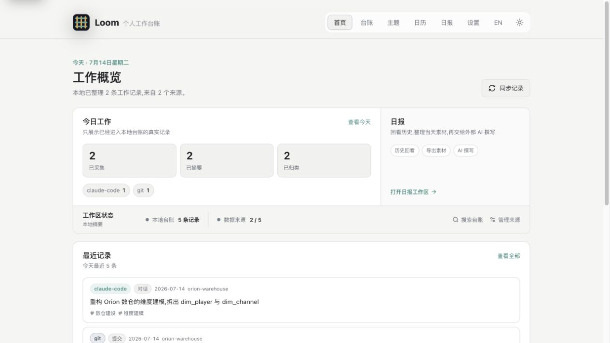
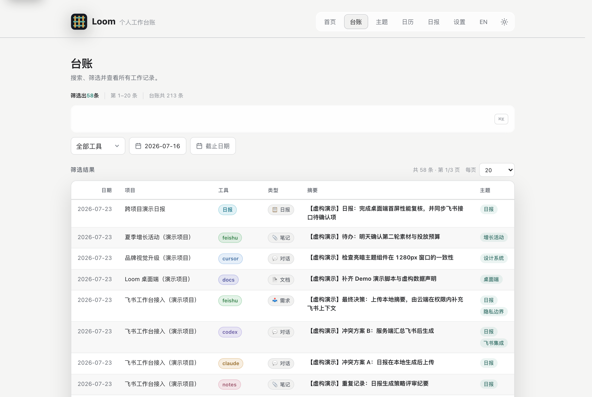
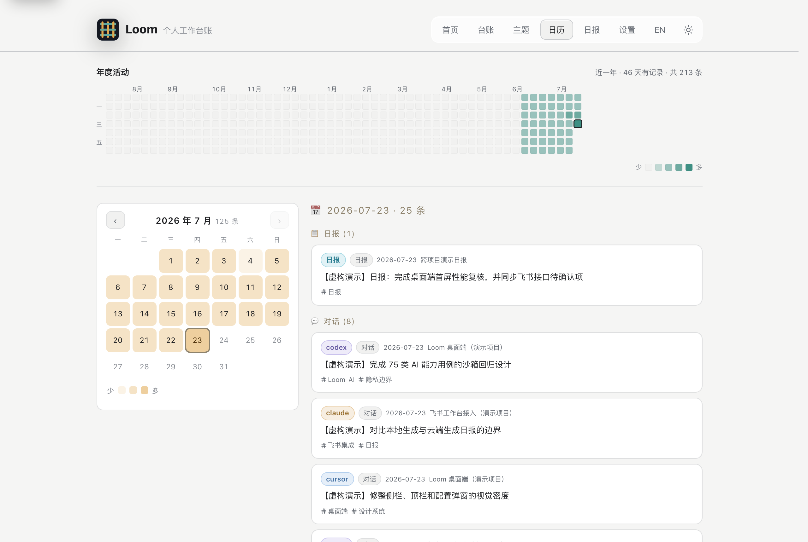
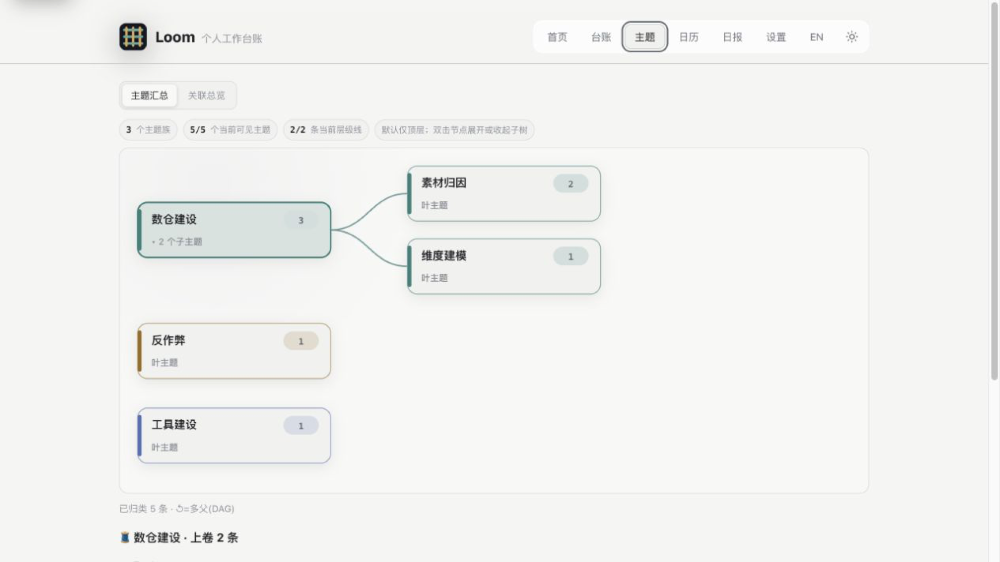
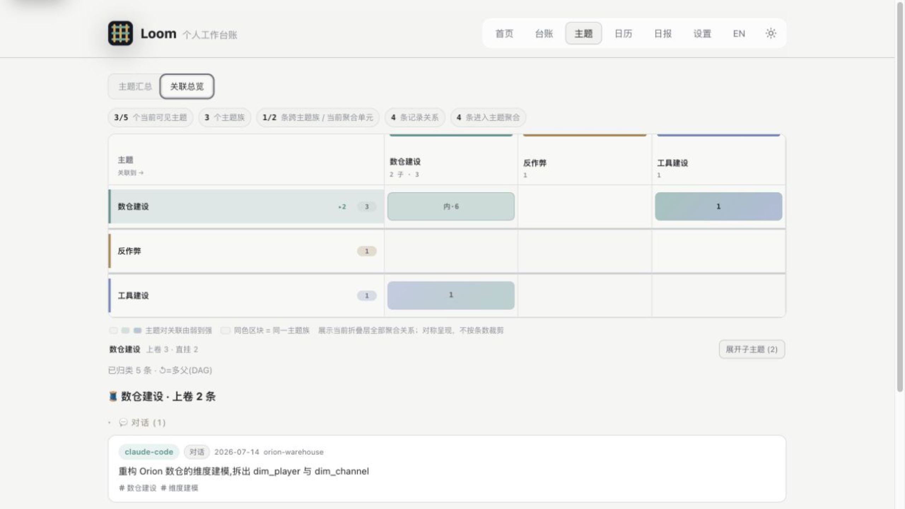

<div align="center">


# loom

**把散落各处的工作痕迹 —— git 提交 · AI 对话 · 文档 · 代码 · 数据 —— 织成一本可检索、可关联的本地台账**

一份扁平真相 → 派生按天日记 · 全文检索 · 主题关联 · 私有云备份;每条带**回链**,一跳回原文。

<br>


[](./LICENSE)


**简体中文** | [English](./README.en.md)

[🚀 快速开始](#-快速开始) · [📸 界面](#-界面预览loom-serve) · [🧵 设计](#-为什么是这样) · [⌨️ 命令](#️-常用命令) · [🛡️ 数据与安全](#️-数据与安全)

<br>

</div>

---

**loom(织机)** 把散落在多个 git 仓、多个 AI 工具会话(Claude / Codex / Cursor / CodeBuddy / pi / OpenCode)、文档、代码、数据里的**你自己**的工作痕迹,归一成一份扁平记录,再织出可检索、可按主题追溯、可私有云备份的台账。**纯标准库 Python,零第三方依赖**——clone 即用。

## 🚀 快速开始

装 loom = 两样东西:**`loom` 命令**(CLI,真正干活的)+ **loom 技能**(装进你的 AI 助手,让它会用 `loom`)。挑一种:

**① Claude Code —— 装成原生插件(最快)** · 在 Claude Code 会话里输入斜杠命令(不是终端):

```
/plugin marketplace add joycastle/loom
/plugin install loom@joycastle
```

**② Codex / Cursor / 任意终端 —— 一行装** · 装好 `loom` 命令 + 把技能装进在场的所有 AI 助手,零 pip、零打包:

```bash
curl -fsSL https://raw.githubusercontent.com/joycastle/loom/main/install.sh | sh
```

**③ 手动**:

```bash
git clone https://github.com/joycastle/loom.git ~/Documents/loom && cd ~/Documents/loom && ./install.sh
```

装完:`loom sync` 采集,`loom serve` 浏览器看管理页。日常就一条 `loom sync`(上云加 `--push`)。

**让 AI 直接调用 loom(MCP)** · skill 教 AI 怎么敲命令,MCP 则把 loom 变成 AI 编码工具的**原生工具**——写代码时直接 `loom_search` 查台账、`loom_note` 归档,不用记命令:

```bash
claude mcp add loom -- loom mcp-serve      # Claude Code;或写进项目 .mcp.json
```

暴露 `loom_search` / `loom_topic_ls` / `loom_topic_show` / `loom_today` / `loom_note` 五个工具(读多写少,写入由客户端向你确认)。纯 stdio JSON-RPC,零依赖。

> **想让 AI 帮你把历史资料也整理好?** `git clone` 后用你的 AI 助手打开这个目录,说一句「**读 ONBOARDING.md,带我配置并整理历史**」。它会自动读到入口文件(`AGENTS.md` / `CLAUDE.md`),照 [`ONBOARDING.md`](./ONBOARDING.md) 走完:配置 → 首次采集 → 收编散落文档/数据 → 私有云备份 → 主题分类 → 日常。

## 📸 界面预览(`loom serve`)

> 本地零依赖浏览页,仅 127.0.0.1,纯管理无聊天。下图 `loom serve` 实拍,**虚构演示数据**。



| 台账(全文检索 + 筛选 + 分页) | 日历(月历热力 + 当天全景) |
|:---:|:---:|
|  |  |

| 主题层级树(双击展开) | 跨主题关联总览 |
|:---:|:---:|
|  |  |

主题页把两种视角分开呈现:「主题汇总」用树形布局展示父子层级,默认仅显示顶层、双击逐层展开;「关联总览」用聚合矩阵展示不同主题族之间的真实结构关联。

## 🧵 为什么是这样

loom 的价值不在"又一个笔记工具",而在几个刻意的设计取舍(完整技术细节见 [`docs/loom_showcase.html`](./docs/loom_showcase.html) · [产品导览](https://htmlpreview.github.io/?https://github.com/joycastle/loom/blob/main/docs/loom_tour.html)):

- **扁平存储,按需成视图** —— 只按稳定 `id` 存一份真相(`entries.jsonl`);"按天/按主题/按项目"都是同一份数据的不同切法,加一次多轴皆可见。
- **只存「摘要 + 回链」** —— 每条留最值钱的短文本 + 一个 `ref` 指针,全文/diff/原件留原地;上千条依然轻,每条可溯源。
- **入库前打码** —— token / 密钥 / webhook 写入前就抹掉(只抹值、留变量名);凭证只进 `~/.loom/.env`(chmod 600),绝不进任何仓。
- **两种关联,互补** —— **主题 DAG** 是人工的语义边(「一件事」,条目打叶子标签、层级写主题页、上卷整棵子树);**关系层**(`loom related`)是自动的结构边,从条目已有字段派生:会话时段内的提交=它的产出、共改同一文件的提交、改动某文档的提交、同一对话的跨天续接——零人工、重采即刷新。
- **日报 / 会话摘要是 AI 合成的派生产出** —— 不是采集源;`loom report gen` 喂 AI 写日报,`loom session gen` 读会话问答写准标题+可检索摘要,存独立 sidecar、重采不丢。

## ⌨️ 常用命令

```bash
loom init                      # 交互引导:身份 / 扫仓 / 飞书
loom sync [--push]             # 采集全部源 → 渲染 → 提交(--push 上云)。日常就这条
loom serve [--port 8787]       # 本地管理页(仅 127.0.0.1):首页/台账/日历/主题/日报 + 设置
loom mcp-serve                 # MCP server(stdio):把 loom 暴露给 Claude/Codex 等当原生工具
loom search <词> [--tool T] [--since D]   # 全文检索(中文子串;空词 + 过滤 = 浏览)
loom related <条目id>          # 自动派生的关联:会话产出的提交/共改文件/文档↔提交/对话续接
loom topic ls | show <主题>    # 主题树 / 上卷查一件事的全景
loom note "<文本>" [--to 类目] # 随手信息入库(--update <关键词> 追加到已有条目)
loom report gen <日期> | set   # 日报:AI 合成 → 回库
```

完整命令(`doc add` / `data add` / `session` / `deprecate` / `repo` / `identity` / `source` 等)与参数见 [`docs/`](./docs/) 或 `loom <命令> -h`。

## 🛡️ 数据与安全

```
多股采集来源                归一 + 打码          派生
git · Claude/Codex ┐                        ┌ 全文检索 FTS5(中文子串)
pi · OpenCode      ├─► loom ─► entries ────►│ 按天日记 · 主题 DAG(可上卷)
Cursor · CodeBuddy │   (归一·打码)  一份真相  │ 日报(AI 合成)
仓库文档 · 数据 · 散信息 ┘                    └ 私有云备份(git push)
```

- **原始数据不上云** —— 只有 `vault/` 的 markdown 走 `loom sync --push` 到**你自己的**私有 git remote;`entries.jsonl` 全文、原始 `detail`、`_data/` 的 csv/xlsx、`.env` 由代码强制的 `.gitignore` 留本地。
- **代码 / 数据物理隔离** —— 本仓 = 共享代码(可公开);你的实例在 `~/.loom/`(`init` 生成、不入代码仓:`config.json` 身份/源开关、`.env` 凭证、`data/` 归一条目+FTS 索引、`vault/` 日记+文档→独立私有仓)。`LOOM_HOME` 可覆盖 `~/.loom`。
- **诚实的取舍** —— 检索是关键词非语义;飞书打点走[独立机器人](./docs/loom-bot-design.md)不在 loom 内读 IM;日报由外部 AI 合成,loom 只出料。

## 许可

[MIT](./LICENSE) —— 随便用、随便改、随便分发,不担保。

---
**给拿到本仓的 AI 助手**:先读 [`AGENTS.md`](./AGENTS.md)(或 [`CLAUDE.md`](./CLAUDE.md));数据整理照 [`ONBOARDING.md`](./ONBOARDING.md) 执行;加采集器等扩展见 [`docs/`](./docs/)。
